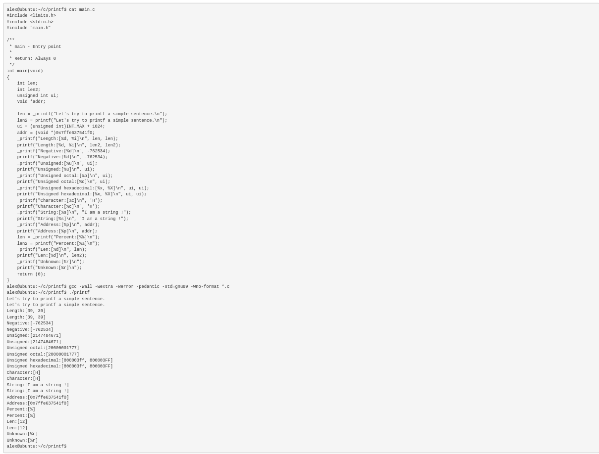

# Printf Project

As part of the SE Foundations curriculum, we embarked on a collaborative project to create our own version of the `printf` function. This fundamental C programming component is responsible for producing formatted output. The project aimed to deepen our understanding of group projects, pair programming, flowcharts, technical writing, and the inner workings of the `printf` function.



## Objectives

Our primary objective was to replicate the behavior of the standard `printf` function, generating formatted output based on a provided format string. We tackled the implementation of a subset of conversion specifiers, including `%c`, `%s`, `%d`, `%i` and additional custom specifiers. The project placed a strong emphasis on maintaining code structure, following the Betty style, and effectively managing memory using `malloc` and `free`.
Notable Features

## Key Features Highlight

This is a highlight of the supported features of our `printf` function.

- Implementation of basic conversion specifiers (`%c`, `%s`, `%%`).
- Support for integer conversion specifiers (`%d`, `%i`).
- Additional conversion specifiers (`%u`, `%o`, `%x`, `%X`).
- Custom conversion specifiers (`%b`, `%S`, `%p`).
- Handling of flag characters (`+`, `space`, `#`).
- Length modifiers for non-custom conversion specifiers (`l`, `h`).
- Field width and precision handling.
- Support for flag characters (`0`, `-`).
- Implementation of custom conversion specifiers (`%r`, `%R`).

## How to Compile

Follow the steps below to compile.

**STEP 1**: Clone the repository and cd into the project.

```bash
git clone https://github.com/Abdulmuizz98/printf.git

cd printf
```

**STEP 2**: You need a main function to compile successfully. You can use any of our test main fiiles in the test directory.

```bash
cp test/main.c .
```

**STEP 3**: Compile

If you have make installed. Run the command below.

```bash
make
```

Otherwise compile explicitly with gcc. Run the command below.

```bash
gcc -Wall -Werror -Wextra -pedantic -Wno-format -std=gnu89 *.c
```

## Features (Detailed)

The supported features include:

### Primary Features

1. **Basic Conversion Specifiers:**

   - `%c`: Character
   - `%s`: String
   - `%%`: Percent sign

2. **Integer Conversion Specifiers:**
   - `%d`: Decimal
   - `%i`: Integer

### Advanced Features

1. **Binary Conversion Specifier:**

   - `%b`: Binary (custom conversion specifier).

2. **Additional Integer Conversion Specifiers:**

   - `%u`: Unsigned decimal
   - `%o`: Octal
   - `%x`: Hexadecimal (lowercase)
   - `%X`: Hexadecimal (uppercase)

3. **String Conversion Specifier:**

   - `%S`: String with special handling for non-printable characters.

4. **Pointer Conversion Specifier:**

   - `%p`: Pointer

5. **Flag Characters Handling:**

   - `+`: Forces a sign (+ or -) to be used for signed conversions.
   - `space`: If no sign is going to be written, a space is inserted before the value.
   - `#`: Used with `o`, `x`, or `X` conversions, the value is preceded with `0`, `0x`, or `0X` respectively.

6. **Length Modifiers Handling:**

   - `l` and `h` for non-custom conversion specifiers (`d`, `i`, `u`, `o`, `x`, `X`).

7. **Field Width Handling:**

   - Field width for non-custom conversion specifiers.

8. **Precision Handling:**

   - Precision for non-custom conversion specifiers.

9. **Zero Flag Character Handling:**

   - `0`: Pads the field with zeros (0) instead of spaces when padding is specified.

10. **Left Alignment Flag Character Handling:**

    - `-`: Left-align the result within the field.

11. **Custom Conversion Specifiers:**
    - `%r`: Reverses a string.
    - `%R`: Applies ROT13 encoding to a string.

## Author Information

- **Authors:** Abdulmuizz Hamzat, Hassan Olaitan
- **Twitter:** [@AbdulmuizzHamz1](https://www.twitter.com/AbdulmuizzHamz1)

## Tackling Challenges in Our Printf Project

### 1. Juggling Memory Management

- **Challenge:**
  Memory management was like walking through a maze with double frees and unexpected segment faults.

- **How We Rolled:**
  Introduced a cool data structure and made a habit of setting freed memory to null. Voila! Fewer double frees, fewer headaches.

### 2. The Wild World of Pointers

- **Challenge:**
  Pointers, especially the char ones, and their arithmetic had us scratching our heads.

- **How We Nailed It:**
  Dove deep into pointer tutorials, had some "aha" moments, and even crafted functions to boss around char pointers. Now, pointers fear us.

### 3. Flags: The Unruly Rebels

- **Challenge:**
  Flags rebelled, acting differently for different specifiers. Chaos, we tell you!

- **Our Superpower:**
  Created special functions for each specifier to keep flags in check. No more rebellions, just order.

### 4. Overflow Drama at the Margins

- **Challenge:**
  Overflow crashing the party, especially with `lh` sub-specifier. Not cool.

- **Our Rescue Plan:**
  Picked the right data types to keep the overflow drama at bay. Also, built a data structure for slick appending and buffer writes. Less syscall drama, more efficient party.

### 5. Unmasking Bugs and Debugging Parties

- **Challenge:**
  Bugs were the sneaky guests at our coding party. Testing was our bouncer.

- **How We Caught 'Em:**
  Fired up our debugging skills, found those sly bugs, and beefed up testing. Turns out, bugs don’t like a well-lit room.

These were our epic battles in the Printf Project – where memory, pointers, flags, overflows, and bugs all tried to throw a party. Guess what? We threw a better one! 🎉✨

## Acknowledgments

The following resources were helpful during the project.

1. [Secrets of “printf”](https://www.academia.edu/10297206/Secrets_of_printf_) by Professor Don Colton, Brigham Young University Hawaii.
2. Printf function brief - What to know to create your own Printf function, by ALX SE.
3. The detailed printf man page.

## License

This project is licensed under the [MIT License](./LICENSE)
